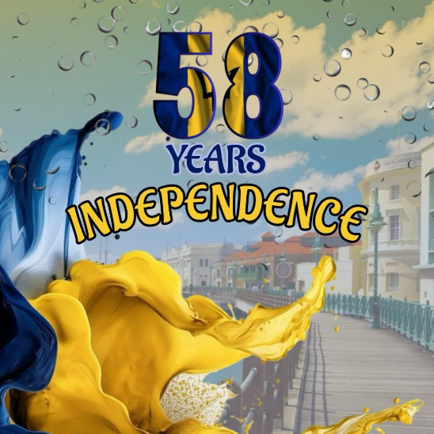
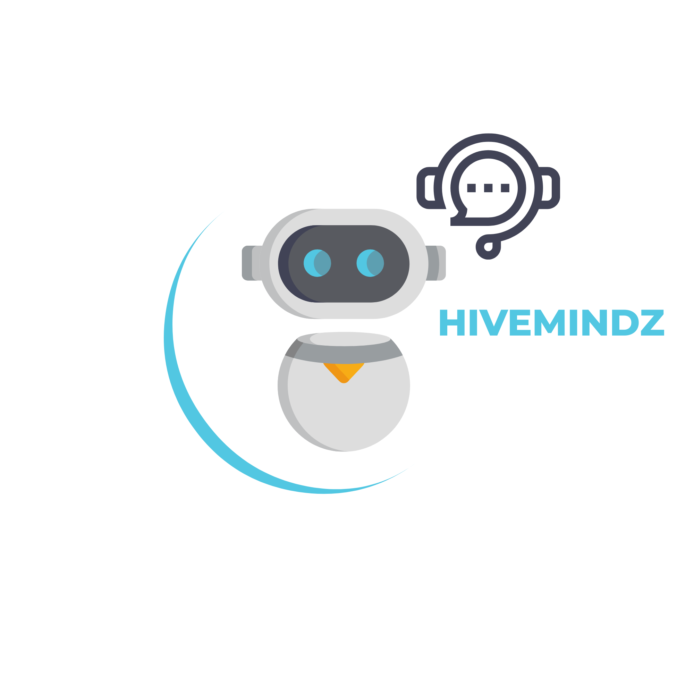
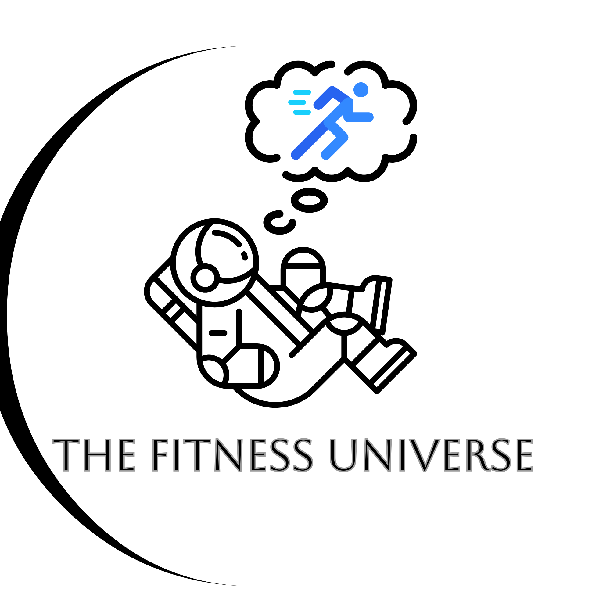
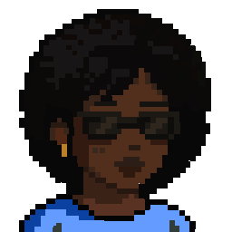

# Portfolio

Hi! I'm T'Shara Haynes, a Computer Science student with a passion for design, games, and interactive storytelling. Here's a look at some of my work

---

## 🕹️ Game Projects

### RPG Scene Demo (Pygame)

📂 [View Source Code](https://github.com/sharhaynes/knightly-adventures)
📂 [View Game Graphics](games/knightly_adverntures_screenshotscene1.png)

### SNAKE 
📂 [View Source Code](https://github.com/sharhaynes/Snake-Game)
📂 [View Game Graphics](games/snake/snake_game_graphics.png)

---

## 🎨 Poster Designs

## 🎨 Logo Designs

### HiveMindz Logo

### The Fitness Universe Poster

---

## 🧑‍🎨 Pixel Art

  
Portrait with shades in the pixel art style. Created on Aseprite

  

